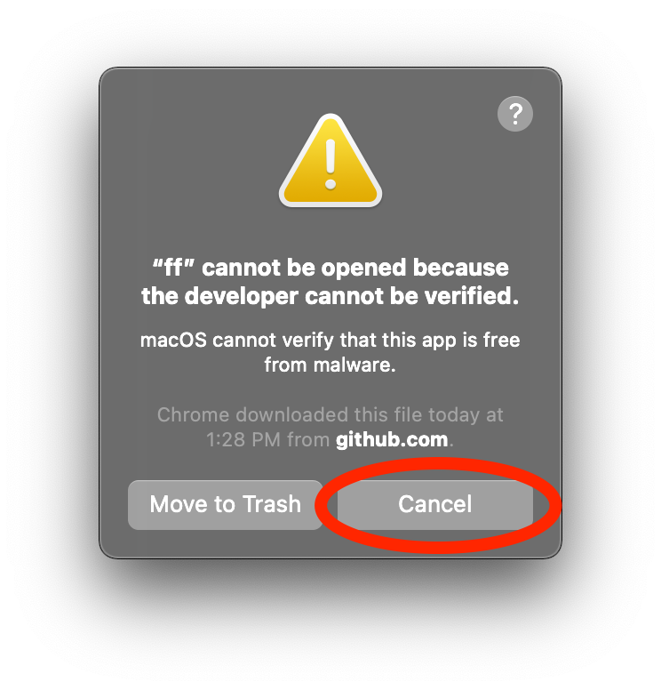
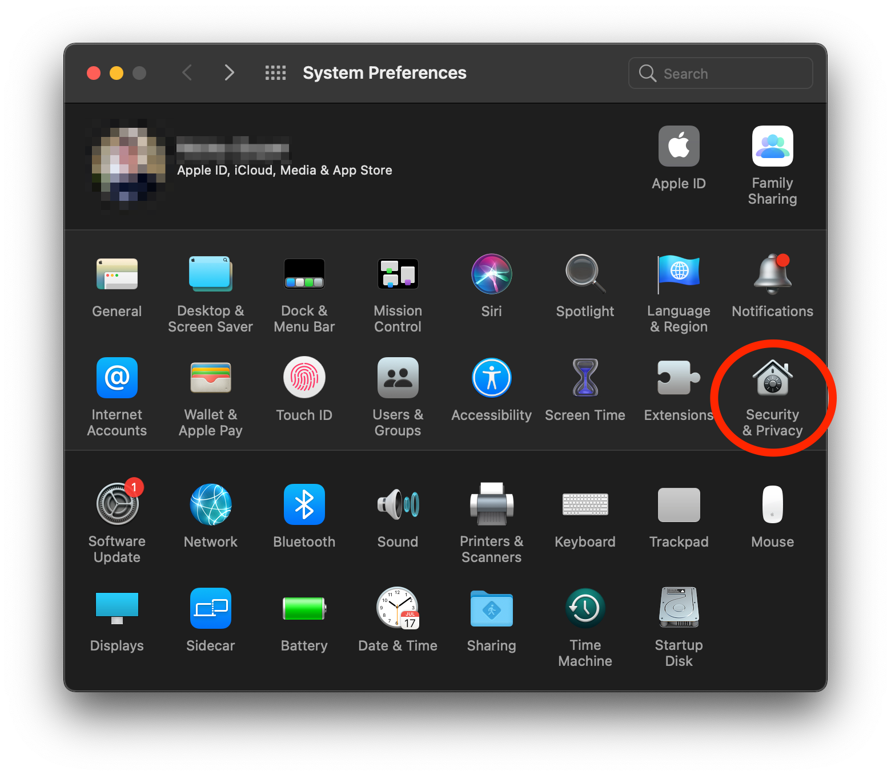
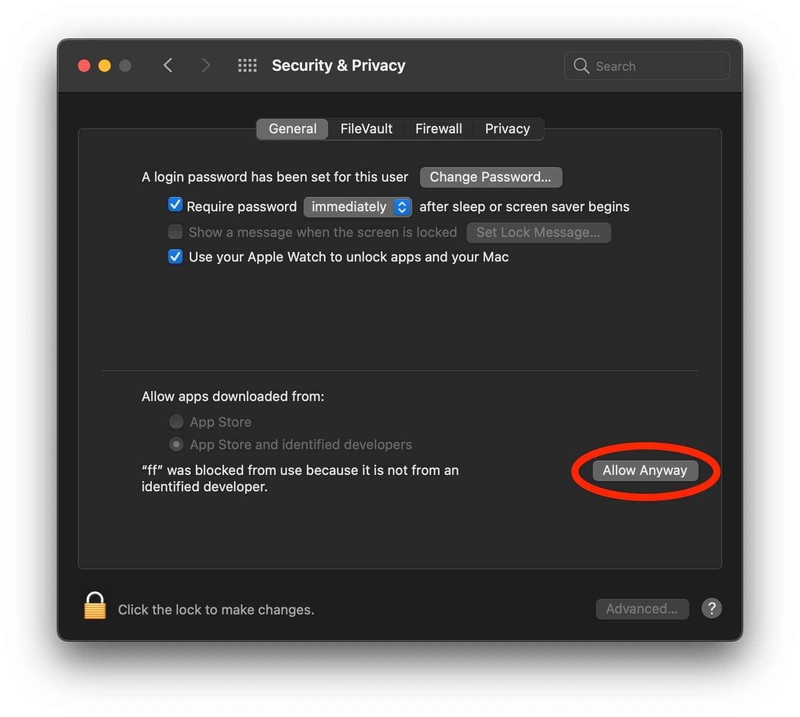
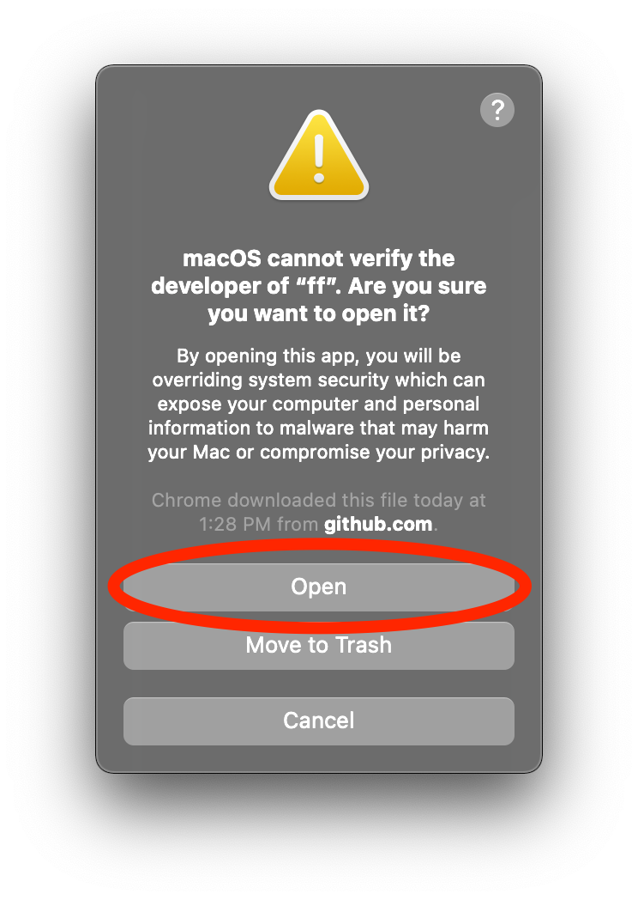

# Allow the FireFly CLI to run on macOS

On macOS default security settings prevent running arbitrary executable files downloaded from the internet, so you'll need to approve the FireFly CLI. You will only have to go through these steps once after installing, or updating the FireFly CLI. The first time you try to run `ff` in your terminal you will likely see a dialog like this. Simply cancel this dialog.

## If you see this dialog, cancel it

## Go to System Preferences and click on Security & Privacy

## Click on the Allow Anyway button

## Now try running `ff` again and click Open

Now try running the `ff` command in your terminal and a final confirmation dialog should appear. Click open:

This time the `ff` command should succeed and you should see something like this in your terminal:

